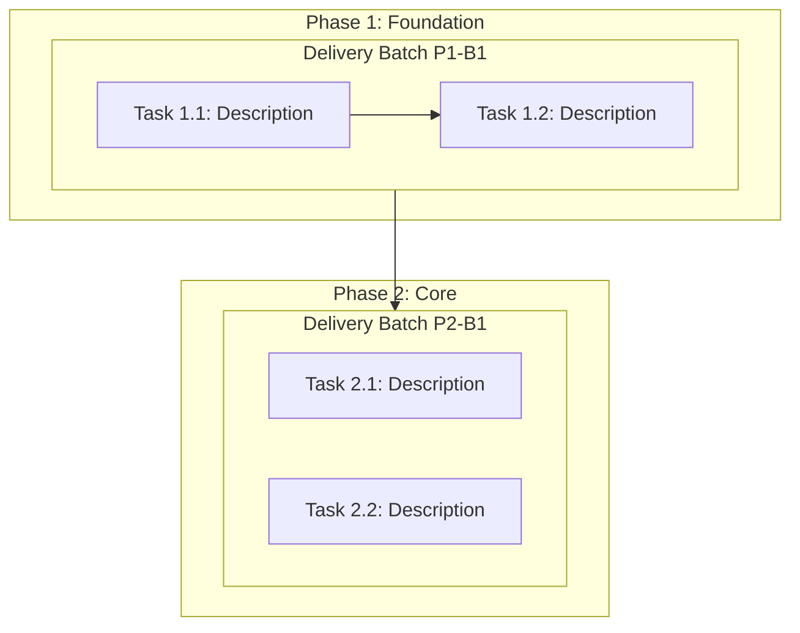

# Templates des documents de plan

Templates des trois documents générés en phase 3 (Décomposition de la
tâche). Sortie vers `docs/plan/`.

---

## task-breakdown.md

```markdown
# Task Breakdown

## Vue d'ensemble
- **Total des phases** : N
- **Total des tâches** : N
- **Lots de livraison planifiés** : N
- **Effort total estimé** : S/M/L/XL

## Contraintes de design S.U.P.E.R

> Toutes les tâches de ce plan doivent produire du code conforme aux
> principes d'architecture S.U.P.E.R. Les contraintes suivantes s'appliquent
> globalement — en cas de conflit, les règles sourcées du kit priment
> (rules/core/philosophy, rules/core/universal) :

- **S (Rôle unique)** : chaque nouveau module/fichier/fonction résout
  exactement un problème. Si une tâche couvre plusieurs responsabilités,
  décompose-la davantage.
- **U (Flux unidirectionnel)** : les données circulent entrée → traitement →
  sortie. Les dépendances pointent vers l'intérieur. Pas d'imports
  circulaires.
- **P (Ports sur l'implémentation)** : définis les contrats d'interface
  (schémas, types) avant l'implémentation. Tout l'I/O inter-modules doit être
  sérialisable.
- **E (Indépendant de l'environnement)** : pas de config codée en dur. Toutes
  les valeurs spécifiques à l'environnement viennent de variables
  d'environnement ou de fichiers de config.
- **R (Parties remplaçables)** : chaque composant doit être remplaçable sans
  changements en cascade. Valide avec le test de remplacement : « Puis-je
  échanger ceci avec une autre implémentation en ne touchant que ce module ? »

## Contraintes de test et de gouvernance

> Ces contraintes s'appliquent à chaque tâche sauf si la tâche déclare
> explicitement pourquoi elles ne sont pas applicables.

- **Tests par défaut** : le travail de fonctionnalité, les changements de
  comportement, les changements d'API/schéma/migration, le parsing, le
  routage, les permissions, le cache et la persistance doivent ajouter ou
  mettre à jour des tests automatisés pertinents.
- **Exemption de test explicite** : les tâches de pure documentation/config
  peuvent marquer les tests comme non applicables, mais les critères
  d'acceptation doivent expliquer pourquoi et nommer la commande de validation
  la plus proche à exécuter.
- **Mises à jour d'instructions d'agent** : si une tâche change la façon dont
  les futurs agents doivent travailler dans le dépôt, mets à jour les surfaces
  d'instructions résolues telles que `AGENTS.md` ou les fichiers de règles
  plateforme existants.
- **Mises à jour mémoire** : si une tâche introduit une règle durable, un
  invariant, un gotcha récurrent, une commande ou une convention de projet,
  mets à jour la surface mémoire native résolue (`.pi/memory/`) ou le fallback
  explicitement choisi.
- **Séparation tâches/lots** : les tâches sont des enregistrements atomiques
  de travail et de télémetry. Les lots de livraison sont des unités
  d'implémentation, de validation d'intégration. Défaut : un lot cohérent par
  phase ; chaque division et chaque lot à tâche unique doivent avoir une
  justification enregistrée sauf si la phase ne contient qu'une seule tâche.

## Phase 1 : <Nom de la phase>
**But** : ce que cette phase atteint
**Prérequis** : ce qui doit être fait avant cette phase
**Focus S.U.P.E.R** : quels principes S.U.P.E.R sont les plus pertinents pour
cette phase (ex. « P — définir les contrats d'interface avant d'implémenter
les modules »)

| # | Tâche | Priorité | Effort | Dépend de | Lane | Lot | S.U.P.E.R | Attente de test | Impact mémoire | Critères d'acceptation |
|:--|:------|:--------|:-------|:----------|:-----|:----|:----------|:----------------|:---------------|:-----------------------|
| 1 |       | P0      | M      | —         | A    | P1-B1 | S, P | Ajouter/mettre à jour des tests | Mettre à jour la surface mémoire résolue si un nouvel invariant émerge | |
| 2 |       | P1      | S      | —         | B    | P1-B1 | U, E | Non applicable : docs uniquement | Aucun | |
| 3 |       | P1      | S      | 1         | A    | P1-B1 | R | Ajouter/mettre à jour des tests de régression | Mettre à jour les surfaces d'instructions résolues si une règle de workflow change | |

> **Colonne S.U.P.E.R** : liste les principes S.U.P.E.R qui sont les drivers
> de design principaux de cette tâche. L'agent implémentant la tâche doit
> porter une attention particulière à ces principes. Les critères
> d'acceptation de chaque tâche incluent implicitement : « Passe le S.U.P.E.R
> Quick Check pour les principes listés. »
> **Colonne Attente de test** : doit nommer le travail de test attendu ou la
> justification explicite de non-test plus la commande de validation la plus
> proche.
> **Colonne Impact mémoire** : doit indiquer si la tâche peut affecter la
> surface mémoire résolue ou toute surface d'instructions résolue.
> **Colonne Lot** : chaque tâche appartient à exactement un lot planifié.

### Lanes parallèles
| Lane | Tâches | Effort combiné | Risque de fusion | Fichiers clés |
|:-----|:-------|:---------------|:-----------------|:--------------|
| A    | 1, 3   | M              | Faible           |               |
| B    | 2      | S              | Faible           |               |

> Les tâches de lanes différentes n'ont aucune dépendance mutuelle et peuvent
> être exécutées simultanément par des sous-agents séparés. Les agents de lane
> renvoient des commits ; ils ne créent pas d'états partagés. Le risque de
> fusion indique la probabilité de conflits de fichiers avant l'intégration
> dans la branche du lot.

### Lots de livraison

| Lot | Tâches | Vagues d'exécution | But et justification du regroupement | Branche d'intégration | Validation combinée | Dépend de | Justification de division / lot unique |
|:----|:-------|:-------------------|:-------------------------------------|:----------------------|:--------------------|:----------|:--------------------------------------|
| P1-B1 | 1, 2, 3 | V1 : Lane A (T1 → T3) + Lane B (T2) | Unité cohérente d'architecture et de revue | `batch/p1-b1-<slug>` | tests ciblés + build/smoke complet affecté | — | Lot par défaut au niveau phase |

> Revois l'ensemble complet des tâches de la phase avant de définir les lots.
> Préfère un lot validable au niveau phase. Ne divise que pour une frontière
> concrète de revueabilité, de release/rollback indépendant, de propriété,
> d'isolation de risque, de dépendance dure ou de politique dépôt/utilisateur ;
> ne divise pas mécaniquement par nombre de tâches.

## Phase 2 : <Nom de la phase>
<!-- Même structure que la phase 1 -->
```

---

## dependency-graph.md

````markdown
# Graphe des dépendances de tâches


````

---

## milestones.md

```markdown
# Jalons

| # | Jalon | Phase cible | Critères | Statut |
|:--|:------|:------------|:---------|:-------|
| 1 |       | Après la phase 1 |          | En attente |
| 2 |       | Après la phase 3 |          | En attente |
```
